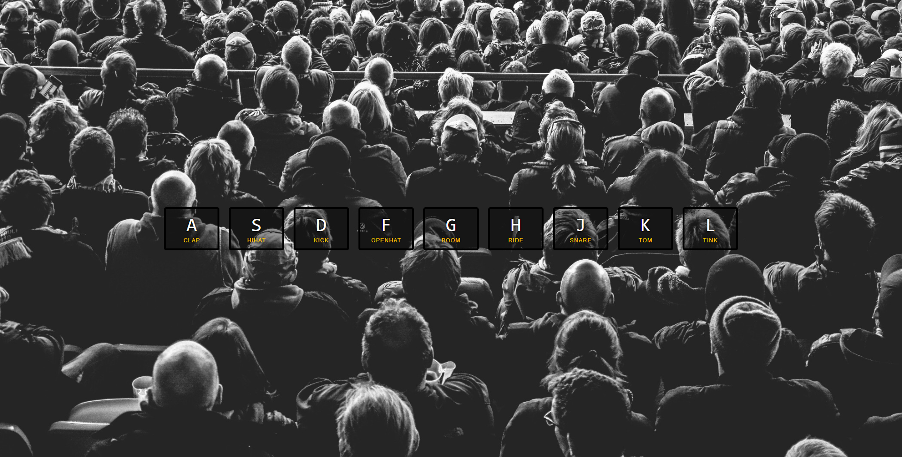

# Project 1 of JavaScript30

Project to practice vanilla JavaScript- hitting keys on keyboard corresponds to different parts of a drum kit

Things learned:
- keyCodes
- keydown event listener
- e as event in function
- ES6 tempalte strings
- playing audio
- adding and removing class list
- transition end event listener
- stage, commit, and push changes to Github from local machine

